## Why this chapter exists

This chapter is about a result that sounds suspicious until each piece of it is translated carefully. We are going to take real cat and dog face images, shrink each image to 64 by 64 pixels, convert it to grayscale, and train one of the simplest classifiers in machine learning: a single perceptron. Then we are going to do something intentionally unfair. We will throw away the true cat and dog labels and replace them with random labels.

Some cats will be assigned $+1$. Some cats will be assigned $-1$. Some dogs will be assigned $+1$. Some dogs will be assigned $-1$. The labels will no longer mean cat or dog. They will just be arbitrary targets attached to real images. The question is whether a perceptron can still fit those random labels perfectly.

For the processed images in this experiment, the answer is yes up through 4097 examples. That does not mean the perceptron learned what a cat is. The labels were random, so there was no cat concept left to learn. It means the model had enough geometric freedom to memorize the particular training examples placed in front of it. That is the central lesson of the chapter: perfect training accuracy is not the same as learning. A model can sometimes fit the examples in front of it because the input space gives it enough room to memorize them.

The point is not that perceptrons are bad, or that high-dimensional models are useless, or that VC dimension explains all of modern deep learning. The point is more precise: when the number of examples is small relative to the number of input dimensions, even a simple linear classifier can have surprising memorization capacity. Random labels make that capacity visible because they remove the semantic pattern we would otherwise be tempted to credit.

## The experiment

This repository builds a complete experiment around the AFHQ animal-faces dataset. The code loads cat and dog images, resizes them to 64 by 64 grayscale, flattens each image into a vector with 4096 numbers, assigns random binary labels, and then runs two related demonstrations.

The first demonstration is an exact separator construction. It builds a matrix from the images, adds a bias column, checks the rank of that matrix, and directly solves a linear system:

$$
X_{\mathrm{aug}}\tilde{w} = y.
$$ {#eq-linear-system}

That equation is the core of the project. It asks whether there is one parameter vector, $\tilde{w}$, whose scores exactly match the labels $y$ for every training image. If the scores equal $+1$ or $-1$, the signs are automatically correct, so the perceptron classifies every training example correctly.

The second demonstration uses the actual perceptron learning rule. Instead of solving the equation directly, it starts with weights at zero and updates the weights whenever the model makes a mistake. This answers a different question: if a separator exists, can the perceptron learning algorithm actually find it, and how long does it take?

@fig-pipeline shows the flow of the experiment.

{#fig-pipeline width="100%"}

## The path through the idea

This chapter assumes no machine learning background. The math is included because the claim is mathematical, but each symbol is introduced where it becomes useful. The route is deliberately slow at the beginning. First, an image becomes a vector. Then a perceptron becomes a weighted sum over that vector. Then the bias term becomes one more column in a matrix. Only after those pieces are in place does the VC-dimension statement become meaningful.

By the end, the symbols should no longer feel like decoration. You should know what $x$ is, what $w$ is, why $b$ can be treated as another weight, what rank is checking, why $X_{\mathrm{aug}}\tilde{w}=y$ proves that a separator exists, why the perceptron learning rule can still take many epochs, and why training accuracy alone cannot tell us whether the model learned a meaningful concept. The thread is simple once the notation is unpacked: a perceptron is a weighted sum, an image is a long list of pixels, and a high-dimensional list gives the weighted sum many adjustable directions. If the examples are independent enough, those directions can be used to fit arbitrary labels.

## The claim in one paragraph

A 64 by 64 grayscale image contains:

$$
64 \times 64 = 4096
$$

pixels. After flattening the image, the perceptron sees one long row of numbers:

$$
x = (x_1, x_2, \ldots, x_{4096}).
$$

The symbol $x$ means one input image after it has been converted into numbers. The value $x_1$ is the first pixel, $x_2$ is the second pixel, and so on.

The perceptron has one weight for each pixel and one bias term. Its score is:

$$
s = w_1x_1 + w_2x_2 + \cdots + w_{4096}x_{4096} + b.
$$ {#eq-score}

The values $w_1,\ldots,w_{4096}$ are the pixel weights. The value $b$ is the bias. The score $s$ is a signed number. If $s$ is positive, the model predicts $+1$. If $s$ is negative, the model predicts $-1$.

For linear classifiers in $d$ input dimensions, the VC dimension is $d+1$. Here $d=4096$, so $d+1=4097$. Under the right rank condition, a linear classifier can fit any binary labels on up to 4097 examples.

That includes random labels.

This is why the experiment matters. If a model fits random labels, the fit cannot be explained by cat features or dog features. The labels no longer correspond to cats or dogs. The fit is a capacity result.

## The data: animal faces become rows of numbers

The dataset is Kaggle's `andrewmvd/animal-faces`, commonly known as AFHQ. It contains high-resolution animal face images in cat, dog, and wildlife categories. This experiment uses only cats and dogs.

The original images are photographs. The perceptron never receives them as photographs. Before training, each image goes through the same processing pipeline:

1. load the image;
2. convert it to grayscale;
3. resize it to 64 by 64 pixels;
4. scale the pixel values numerically;
5. flatten the image into a 4096-number row.

This can feel like the image disappeared, but it has not. A 64 by 64 grid and a 4096-number row contain the same brightness values arranged in different shapes. The grid is easier for us to look at. The row is easier for the model to multiply by weights.

For a tiny 3 by 3 grayscale image, the same idea looks like this:

$$
\begin{bmatrix}
12 & 40 & 91 \\
8 & 55 & 110 \\
4 & 61 & 130
\end{bmatrix}
\quad \longrightarrow \quad
(12, 40, 91, 8, 55, 110, 4, 61, 130).
$$

A vector is just an ordered list of numbers. The order matters because each position corresponds to a location in the original image. Pixel 1 might be the upper-left corner. Pixel 4096 might be the lower-right corner.

Once every image has been turned into a vector, the training set becomes a table. Each row is one image. Each column is one pixel position. If there are $N$ images, the table has $N$ rows and 4096 pixel columns. We call that table $X$.

## The perceptron as a small machine

The perceptron is a linear classifier. It takes the input numbers, multiplies each input by a corresponding weight, adds everything together, adds a bias, and then checks the sign.

@fig-perceptron-anatomy shows the model as a small flow diagram.

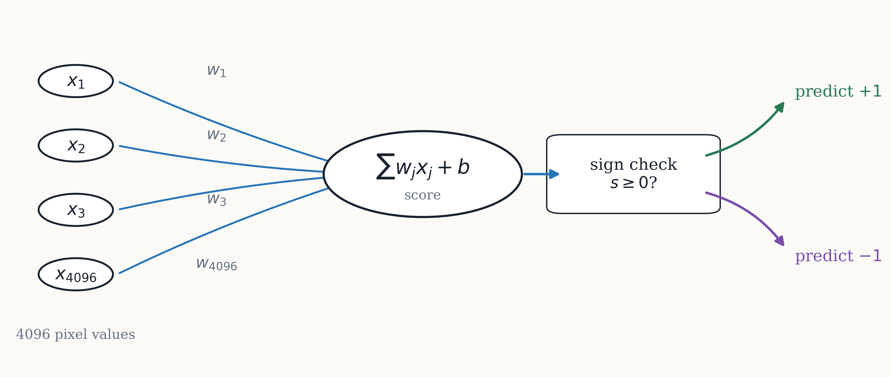{#fig-perceptron-anatomy width="100%"}

The word "linear" matters. The perceptron does not multiply pixels by other pixels. It does not build an eye detector, an ear detector, or a fur detector. It only computes the weighted sum in @eq-score and then checks the sign.

The model's prediction is:

$$
\hat{y} =
\begin{cases}
+1 & \text{if } w^\top x + b \ge 0, \\
-1 & \text{if } w^\top x + b < 0.
\end{cases}
$$

The symbol $\hat{y}$, pronounced "y-hat," means the model's predicted label. The true target label is written $y$. In this experiment, $y$ is either $+1$ or $-1$.

The entire model is contained in $w$ and $b$. The vector $w$ holds the pixel weights. The scalar $b$ holds the bias. Before training, these numbers do not contain useful information. During training, they are adjusted until the signs of the scores match the training labels.

## A line before a hyperplane

The 4096-dimensional case is impossible to draw, so start with two dimensions.

Suppose the perceptron has only two inputs:

$$
s = w_1x_1 + w_2x_2 + b.
$$

The decision boundary is the set of points where the score equals zero:

$$
w_1x_1 + w_2x_2 + b = 0.
$$

In two dimensions, that equation describes a line. Points on one side have positive scores. Points on the other side have negative scores.

Here are three points:

| point | $x_1$ | $x_2$ | label |
|---|---:|---:|---:|
| A | 0 | 0 | -1 |
| B | 1 | 0 | +1 |
| C | 0 | 1 | +1 |

One separator is:

$$
2x_1 + 2x_2 - 1 = 0.
$$

This means $w_1=2$, $w_2=2$, and $b=-1$. Check the score at each point:

$$
\begin{aligned}
A &: 2(0) + 2(0) - 1 = -1, \\
B &: 2(1) + 2(0) - 1 = +1, \\
C &: 2(0) + 2(1) - 1 = +1.
\end{aligned}
$$

The scores exactly equal the labels.

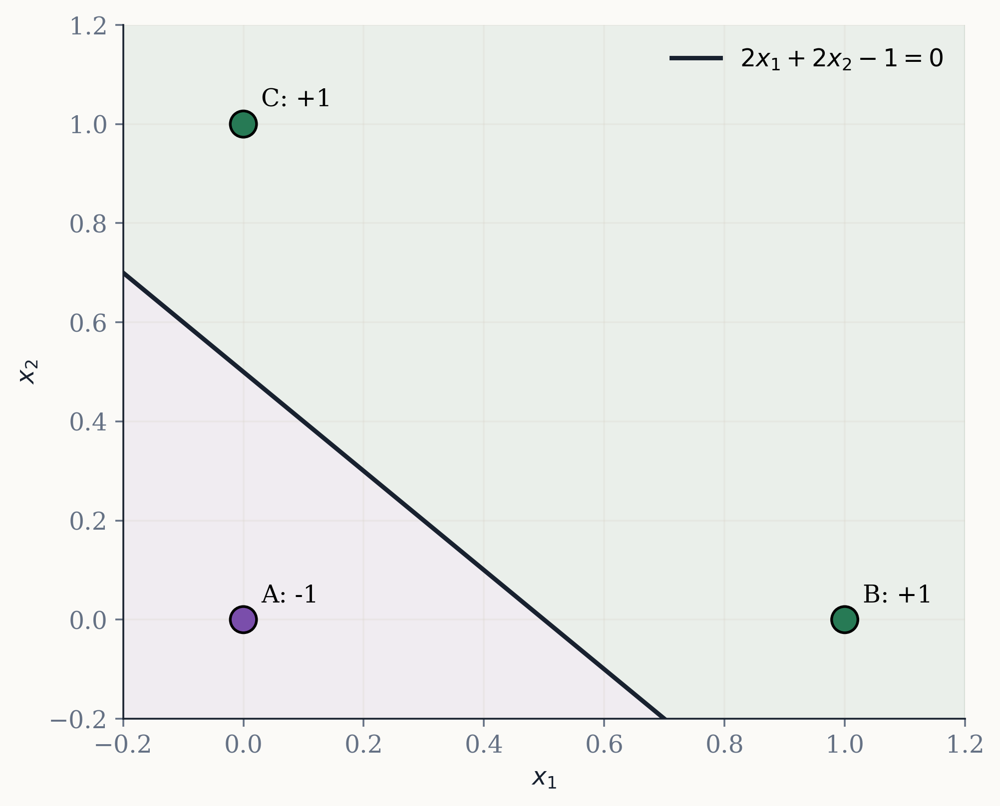{#fig-toy-separator width="64%"}

This tiny example already contains the large result. There are two input dimensions plus one bias term, so there are three adjustable numbers. With three points in a favorable position, those three adjustable numbers can be chosen so the scores match arbitrary binary labels.

For images, replace two input dimensions with 4096. The same kind of separator becomes a hyperplane, which is the high-dimensional version of a line or plane.

## What a perceptron cannot do

The perceptron is limited. A single perceptron can only draw one linear boundary.

The classic failure case is XOR. Four points sit at the corners of a square, with matching labels on opposite corners:

| $x_1$ | $x_2$ | label |
|---:|---:|---:|
| 0 | 0 | -1 |
| 1 | 0 | +1 |
| 0 | 1 | +1 |
| 1 | 1 | -1 |

No single line can separate those labels.

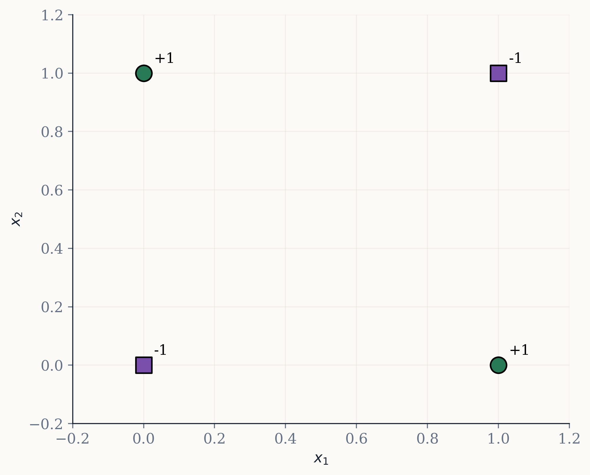{#fig-xor width="58%"}

This is why the result in this chapter should be stated carefully. We are not saying a perceptron can learn every pattern. It cannot. We are saying that when the input dimension is large and the number of examples is not too large, linear separators can fit many arbitrary labelings.

XOR shows the limitation. VC dimension shows the capacity.

## Random labels are the diagnostic

If we trained on true cat and dog labels and got 100 percent training accuracy, we might be tempted to say the model learned cats versus dogs. Maybe it did. But training accuracy alone cannot prove that.

The cleaner test is to destroy the semantic meaning of the labels while leaving the images intact.

That is what this experiment does:

$$
y_i \in \{-1,+1\}.
$$

The subscript $i$ means "for example $i$." So $y_{17}$ is the random label assigned to image 17. These labels are assigned independently of whether the image is a cat or a dog.

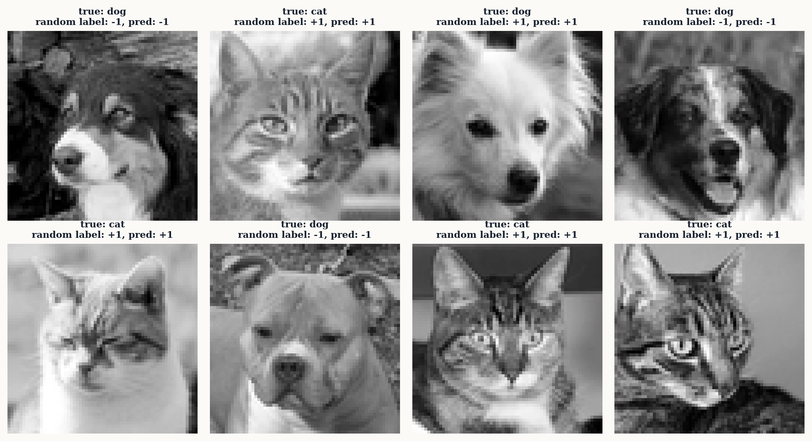{#fig-random-labels width="94%"}

If the perceptron fits those labels, it cannot be because it learned the visual concept cat or dog. The label no longer encodes that concept. The model is fitting a random split of the training images.

That is why random labels are useful. They turn the experiment into a capacity test.

## VC dimension in plain language

VC dimension is a way to measure how flexible a class of models is. The formal theory is deeper than this chapter needs, but the central idea is approachable.

Take $N$ points. If each point can receive one of two labels, there are:

$$
2^N
$$

possible labelings. For three points, there are $2^3 = 8$ possible labelings. For ten points, there are $2^{10}=1024$. For 4097 points, the number is unimaginably large.

A model class is said to shatter a particular set of points if it can fit every possible binary labeling of those points. No matter how you assign $+1$ and $-1$, some model in the class gets all the labels right.

The VC dimension is the size of the largest set of points the model class can shatter in the right geometric position.

For linear separators in $d$ input dimensions, the VC dimension is:

$$
d + 1.
$$ {#eq-vc-dimension}

In this experiment:

$$
d = 4096,
\qquad
d + 1 = 4097.
$$

Plainly stated: a linear classifier in 4096 dimensions can shatter 4097 points in general position.

"General position" is a geometry phrase. It means the points are not arranged in a degenerate way that removes independent directions. In the code, we do not just assume this condition. We check the relevant version directly by computing the rank of the augmented data matrix.

Put differently, VC dimension does not say the perceptron understands cats and dogs. It says the class of linear separators has enough capacity to realize any labeling of a sufficiently well-positioned set of up to 4097 image vectors.

@fig-capacity-boundary shows why the number 4097 is the ceiling in this setup.

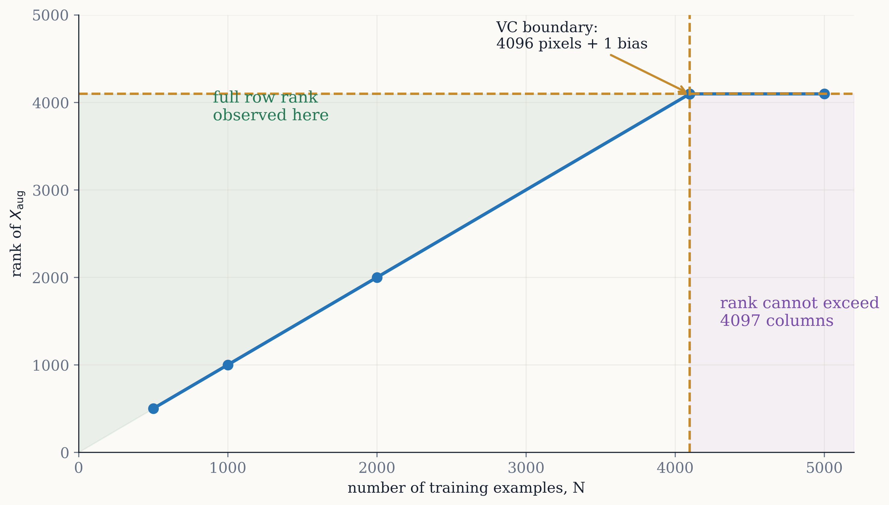{#fig-capacity-boundary width="86%"}

## Why the bias creates 4097 columns

The perceptron score is:

$$
s = w^\top x + b.
$$

The notation $w^\top x$ is shorthand for:

$$
w_1x_1 + w_2x_2 + \cdots + w_{4096}x_{4096}.
$$

The bias $b$ is separate from the pixel weights, but we can fold it into the same vector by adding one extra input that is always equal to 1.

For one image, define the augmented input:

$$
x_{\mathrm{aug}} = (x_1, x_2, \ldots, x_{4096}, 1).
$$

The word "augmented" only means we appended the extra constant value. Now define the augmented parameter vector:

$$
\tilde{w} = (w_1, w_2, \ldots, w_{4096}, b).
$$

The tilde over $\tilde{w}$ is a reminder that this vector includes the bias. With this notation:

$$
s = x_{\mathrm{aug}}^\top \tilde{w}.
$$

This is the same score as before. We have only rewritten it so the bias behaves like one more weight.

For a whole dataset with $N$ images, the augmented matrix $X_{\mathrm{aug}}$ has $N$ rows and 4097 columns. Each row is one image plus the final 1:

$$
X_{\mathrm{aug}} =
\begin{bmatrix}
x_{1,1} & x_{1,2} & \cdots & x_{1,4096} & 1 \\
x_{2,1} & x_{2,2} & \cdots & x_{2,4096} & 1 \\
\vdots & \vdots & \ddots & \vdots & \vdots \\
x_{N,1} & x_{N,2} & \cdots & x_{N,4096} & 1
\end{bmatrix}.
$$

This is the source of the number 4097. It is 4096 pixel weights plus one bias.

## The linear-system construction

The phrase "linear system construction" sounds abstract, but it is just a way of writing down the requirement that every training score should match its label.

For image 1, we want:

$$
x_{1,\mathrm{aug}}^\top \tilde{w} = y_1.
$$

For image 2:

$$
x_{2,\mathrm{aug}}^\top \tilde{w} = y_2.
$$

For image 3:

$$
x_{3,\mathrm{aug}}^\top \tilde{w} = y_3.
$$

Instead of writing one equation per image, we stack them:

$$
X_{\mathrm{aug}}\tilde{w} = y.
$$

@fig-linear-system is the same equation drawn as a matrix.

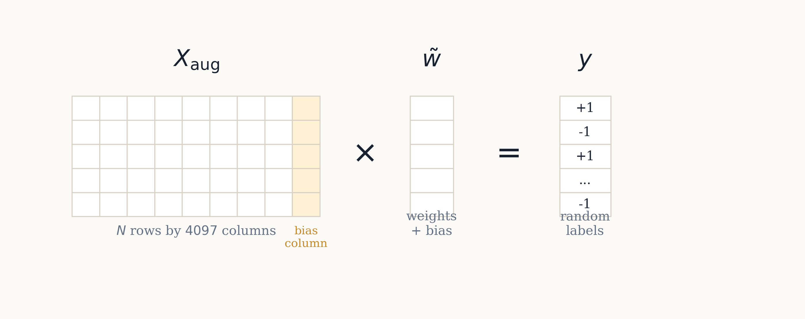{#fig-linear-system width="94%"}

Here is what each object means.

$X_{\mathrm{aug}}$ is the data matrix. It has one row per image and one column per parameter. In this experiment it has 4097 columns.

$\tilde{w}$ is the vector of unknown parameters. These are the numbers we are trying to find: all pixel weights plus the bias.

$y$ is the vector of labels. It has one entry per image. In the random-label experiment, every entry is either $+1$ or $-1$.

The equation asks a direct question: can we find one parameter vector that makes every training score equal the assigned label?

If yes, then every score has the correct sign. A score of $+1$ predicts $+1$. A score of $-1$ predicts $-1$. Solving the linear system is therefore stronger than merely classifying the examples correctly. It sets the score equal to the label itself.

## Rank is the part that makes the proof work

The linear system $X_{\mathrm{aug}}\tilde{w}=y$ is solvable for every possible label vector $y$ when the rows of $X_{\mathrm{aug}}$ are linearly independent.

Rows are linearly independent when no row can be perfectly built from a weighted combination of the other rows. In this project, each row is an image. Full row rank means each training image contributes an independent direction in the augmented pixel space.

Rank is the number of independent rows or columns in a matrix. If $X_{\mathrm{aug}}$ has $N$ rows and rank $N$, then all $N$ rows are independent. We call this full row rank.

Why does that matter? Because full row rank means the map from parameter vectors $\tilde{w}$ to training scores can reach any target vector in $\mathbb{R}^N$. In plainer language, the weights have enough freedom to assign arbitrary scores to the training examples.

The proof chain is:

1. Each processed image is a 4096-dimensional vector.
2. Adding the bias creates a 4097-dimensional augmented vector.
3. Stacking $N$ augmented images gives $X_{\mathrm{aug}}$.
4. If $N \le 4097$ and $\mathrm{rank}(X_{\mathrm{aug}})=N$, the rows are independent.
5. Full row rank implies $X_{\mathrm{aug}}\tilde{w}=y$ has a solution for any label vector $y$.
6. If the solution makes the scores equal $y_i \in \{-1,+1\}$, every score has the correct sign.
7. Therefore a linear separator exists for those labels.

This is the point where it is easy to mix up two claims. The rank construction proves that a separator exists. It does not show that the perceptron learning rule has already found it. That is why this project includes both the exact solve and the training run.

## Why exact scores imply correct classification

Suppose the solve gives:

$$
X_{\mathrm{aug}}\tilde{w} = y.
$$

For one image $i$, this says:

$$
s_i = y_i.
$$

The score $s_i$ is the perceptron's raw score for image $i$. The label $y_i$ is either $+1$ or $-1$.

If $y_i = +1$, then $s_i = +1$, so the perceptron predicts $+1$. If $y_i = -1$, then $s_i = -1$, so the perceptron predicts $-1$.

A compact way to write this is:

$$
y_i s_i = y_i^2 = 1 > 0.
$$

That expression says the label and the score have the same sign. When their product is positive, the point is correctly classified.

This is why the direct solve is so useful. It constructs scores that exactly match the labels, so the training error is zero.

## The perceptron learning rule

The exact solve proves that a separator exists. The perceptron learning rule is the historical training algorithm that tries to find one through mistakes.

It starts with weights at zero. It loops through the training examples. For each image, it computes:

$$
s_i = w^\top x_i + b.
$$

If the sign of $s_i$ matches $y_i$, nothing changes. If the sign is wrong, the model updates its weights:

$$
w \leftarrow w + \eta y_i x_i,
$$

$$
b \leftarrow b + \eta y_i.
$$

The symbol $\eta$, pronounced eta, is the learning rate. It controls the size of the update.

The update is intuitive by cases. If the true label is $+1$ and the model predicts $-1$, the score is too low. The update adds the image vector to the weights. Bright pixels in that image push future scores upward. If the true label is $-1$ and the model predicts $+1$, the score is too high. The update subtracts the image vector from the weights.

So the perceptron builds its weights out of signed copies of training images. Images labeled $+1$ tend to get added when they are misclassified. Images labeled $-1$ tend to get subtracted when they are misclassified.

This also explains why the final weight vector can be reshaped into a 64 by 64 image. There is one weight per pixel location.

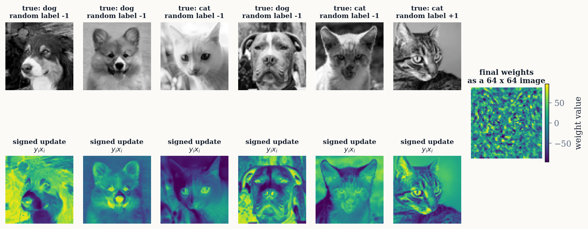{#fig-weight-story width="100%"}

The random-label setting is important here. The weight image in @fig-weight-story should not be interpreted as a cat detector or dog detector. The labels are arbitrary. The weight image is a record of the corrections needed to separate this particular random split.

## Why enough iterations does not give a simple epoch formula

The perceptron convergence theorem says that if the training data are linearly separable, the perceptron learning rule will eventually find a separator. That theorem connects the existence proof to the training process.

But the theorem does not say that 4097 examples take exactly 4097 epochs. It does not even give a tight practical prediction for this dataset. The number of updates depends on geometry.

The most important geometric quantity is the margin.

The margin is the amount of breathing room between the separating hyperplane and the closest training points. A large margin means the classes are separated comfortably. A small margin means a separator exists, but some points sit very close to the boundary.

The classic perceptron mistake bound says that if every input has norm at most $R$, and there exists a unit-length separator with margin $\gamma$, then the perceptron makes at most:

$$
\left(\frac{R}{\gamma}\right)^2
$$

mistakes.

Here $R$ is a bound on the size of the input vectors. The symbol $\gamma$, gamma, is the margin. The important part is the ratio. If the margin is tiny, $R/\gamma$ is large, and the mistake bound becomes large.

Random labels usually create awkward geometry. They ask the model to thread a separator through points that have no clean semantic organization. A separator may exist, but it may have a small margin. That can make perceptron training slow.

So the right separation is:

1. VC dimension and rank tell us whether a separator exists.
2. The perceptron training run tells us how long this algorithm took to find one in this setup.

Those are related, but they are not the same question.

```{=latex}
\newpage
```

## The experimental result

The first sweep trains for 50 epochs. The exact-separator column comes from the linear-system construction. The perceptron column comes from finite perceptron training.

| $N$ | rank of $X_{\mathrm{aug}}$ | exact-separator train error | perceptron train error after 50 epochs | perceptron converged? |
|---:|---:|---:|---:|:---|
| 500 | 500 | 0.0000 | 0.0000 | yes |
| 1000 | 1000 | 0.0000 | 0.0340 | no |
| 2000 | 2000 | 0.0000 | 0.1585 | no |
| 4096 | 4096 | 0.0000 | 0.2925 | no |
| 4097 | 4097 | 0.0000 | 0.2563 | no |
| 5000 | 4097 | 0.0262 | 0.2252 | no |
: Fifty-epoch sweep on randomized AFHQ cat/dog labels. {#tbl-main-results}

The first thing to notice in @tbl-main-results is the rank column. Through $N=4097$, the rank equals $N$. The augmented image rows are independent, so the exact solve fits the random labels with zero training error.

The second thing to notice is the perceptron column. At $N=500$, the perceptron reaches zero training error within 50 epochs. At larger sample sizes, it does not. That does not contradict the proof. It means 50 epochs was not enough.

To test the "given enough iterations" part more directly, the experiment also runs longer perceptron training for the separable sample sizes:

| $N$ | max epochs allowed | epochs to zero error | updates | converged? |
|---:|---:|---:|---:|:---|
| 500 | 50 | 48 | 2638 | yes |
| 1000 | 1000 | 80 | 9046 | yes |
| 2000 | 2000 | 214 | 44162 | yes |
| 4096 | 5000 | 945 | 365288 | yes |
| 4097 | 5000 | 1228 | 381320 | yes |
: Long perceptron runs on randomized labels up to the VC-dimension boundary. {#tbl-long-run}

This is the concrete demonstration. The exact solve proves a separator exists up through 4097 examples in this sampled dataset. The long perceptron runs show the perceptron learning rule actually reaching zero training error at each of those sample sizes.

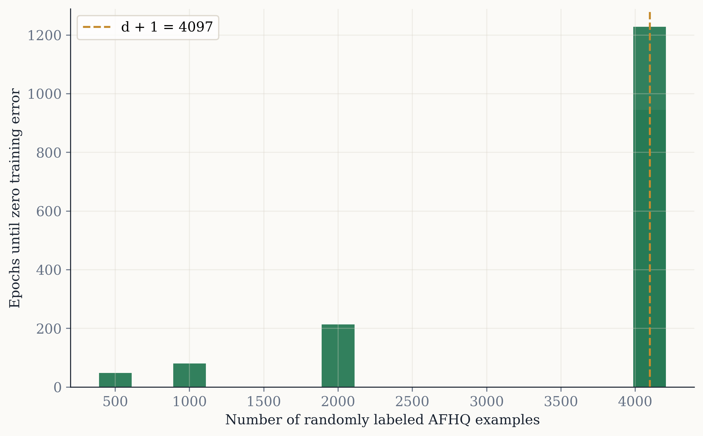{#fig-long-run width="82%"}

The exact epoch counts are not universal. They depend on the random seed, preprocessing, example order, learning rate, and margin. The important result is not that $N=4097$ took 1228 epochs specifically. The important result is that it converged at all on random labels, exactly as the separability result says it can.

## Why the 5000-example row changes

At $N=5000$, the matrix still has only 4097 columns. Its rank cannot exceed 4097. In this run, the rank is 4097, not 5000. That means the rows are no longer all independent.

The exact solve no longer gets zero training error. It gets an error of 0.0262. That is still low, but it is not perfect.

This is the boundary doing its job. The VC-dimension statement gives a shattering guarantee up to $d+1$ examples under the right geometric condition. Once $N$ is larger than $d+1$, the guarantee no longer applies.

That does not mean every labeling above the boundary is impossible to separate. Some particular labelings above the VC dimension can still be separable. VC dimension is about all possible labelings, not one lucky labeling. The random-label test here stops being perfectly fit by the exact construction at 5000 examples.

## Reading the figures

The training-error figure compares the exact separator and the finite perceptron run.

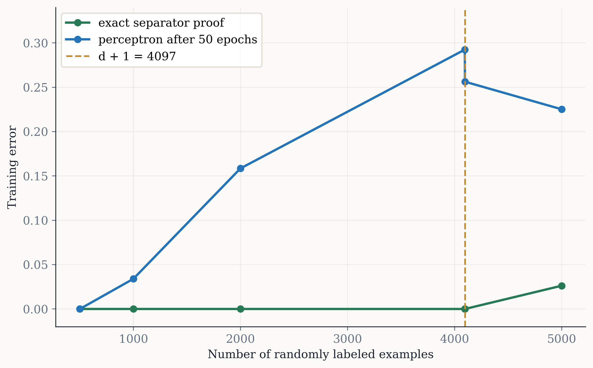{#fig-training-error width="86%"}

The rank figure shows the linear-algebra story:

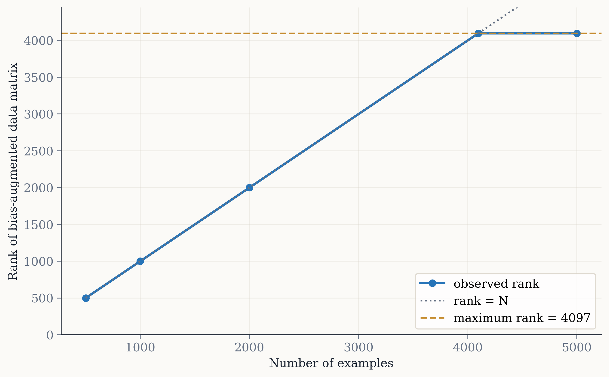{#fig-rank width="86%"}

The update figure shows the practical training cost:

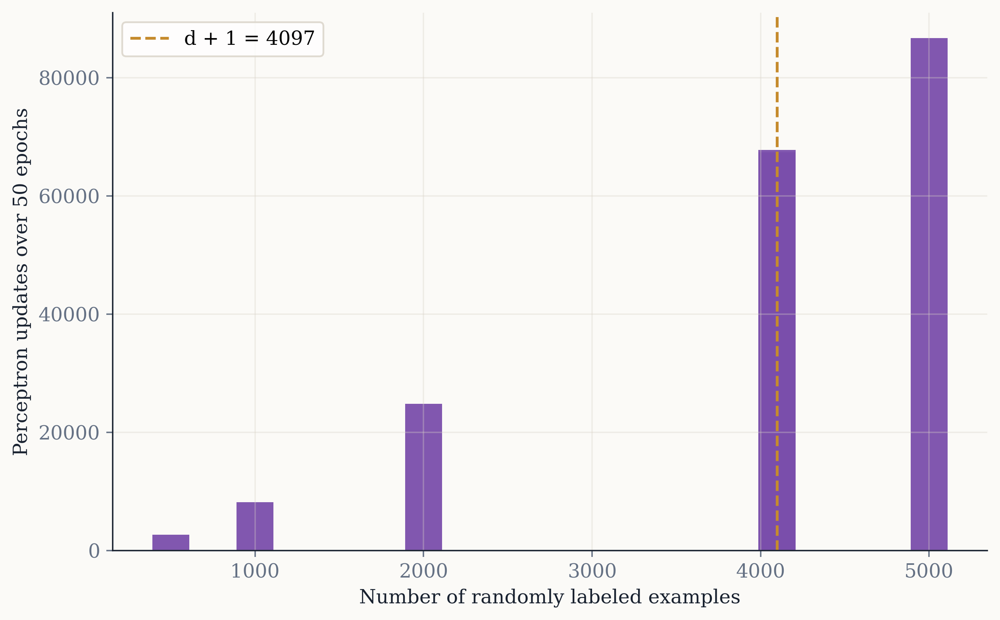{#fig-updates width="86%"}

For $N=500$, the training journey is small enough to visualize more closely:

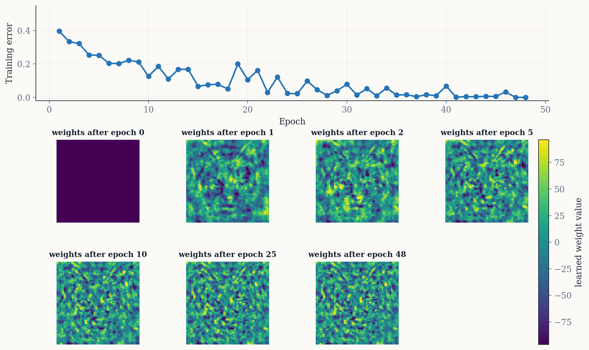{#fig-journey width="100%"}

The training journey makes the distinction concrete. The model starts wrong on many examples. Each update moves the weights. Eventually the training error reaches zero. The model has fit the random labels, but that fit is memorization.

## How the weights store information

It is reasonable to say the perceptron stores information in its weights, but the sentence needs care.

The perceptron does not keep a database of training images. It does not store filenames. But the learning rule makes the final weight vector a sum of signed training examples:

$$
w = \sum_i \alpha_i y_i x_i.
$$

Here $x_i$ is training image $i$, $y_i$ is its label, and $\alpha_i$ records how much that example contributed through mistakes and updates. If an example never caused an update, its contribution may be zero. If it caused multiple updates, its contribution may be larger.

Because the weights are built from image vectors, the final $w$ can be reshaped into a 64 by 64 image. But in the random-label experiment, that image is not a meaningful cat template. It is a signed accumulation of corrections.

The best intuition is:

> The weights are not learning catness or dogness under random labels. They are accumulating just enough signed pixel evidence to separate this particular random split.

## What this does and does not prove

This experiment proves a specific capacity claim on a specific processed dataset. It does not prove that all high-dimensional models only memorize. It does not prove that neural networks cannot generalize. It does not prove that real cat versus dog classification is impossible. It also does not prove that VC dimension alone explains modern deep learning.

It shows something narrower and more durable:

1. A high-dimensional linear model can fit arbitrary labels when the number of examples is small enough relative to the number of input dimensions and the data matrix has the right rank.
2. A perceptron can eventually find a separator when one exists, but the number of epochs depends on geometry.
3. Training accuracy alone cannot distinguish semantic learning from memorization.
4. Random labels are useful because they remove semantic meaning from the target.
5. Generalization requires more than fitting the training set.

That last point is the one that carries over. In real machine learning, we care about performance on new examples. If a model only performs well on the training set, it may have memorized the training examples without learning a useful rule.

## A hand exercise

Before trusting the 4096-dimensional result, solve a small version by hand.

Use the three points:

| point | $x_1$ | $x_2$ | label |
|---|---:|---:|---:|
| A | 0 | 0 | -1 |
| B | 1 | 0 | +1 |
| C | 0 | 1 | +1 |

Add the bias column:

$$
X_{\mathrm{aug}} =
\begin{bmatrix}
0 & 0 & 1 \\
1 & 0 & 1 \\
0 & 1 & 1
\end{bmatrix},
\qquad
y =
\begin{bmatrix}
-1 \\
+1 \\
+1
\end{bmatrix}.
$$

Solve:

$$
X_{\mathrm{aug}}\tilde{w}=y.
$$

This means:

$$
\begin{aligned}
b &= -1, \\
w_1 + b &= +1, \\
w_2 + b &= +1.
\end{aligned}
$$

Since $b=-1$, the other two equations give:

$$
w_1 = 2,
\qquad
w_2 = 2.
$$

So:

$$
\tilde{w} = (2,2,-1).
$$

The separator is:

$$
2x_1 + 2x_2 - 1 = 0.
$$

That is the same separator shown in @fig-toy-separator. The large experiment is not using a different kind of reasoning. It is the same linear-system idea with 4097 columns instead of 3.

## Practice questions

1. In your own words, explain why fitting random labels cannot be evidence that the model learned cats versus dogs.

2. A grayscale image is resized to 32 by 32. What is the input dimension? How many parameters does a perceptron have after adding a bias? What is the VC dimension of linear separators in that input space?

3. Suppose a dataset has $N=100$ examples and $d=20$ input dimensions. Can VC dimension guarantee that a linear classifier can shatter all 100 examples? Why or why not?

4. In the hand exercise, change the labels to $(+1,-1,+1)$. Solve the new linear system and write the separator.

5. Explain why the direct linear-system solve is not the same thing as perceptron training.

6. The long run reaches zero error for $N=4097$ after 1228 epochs. Does VC dimension predict the number 1228? If not, what kind of information would help reason about training time?

7. If a model reaches 100 percent training accuracy and 50 percent test accuracy on balanced random labels, what does that tell you about memorization and generalization?

8. Look at the weight image. Why is it reasonable that the weights can be reshaped into an image? Why would it be misleading to call that image a cat detector in the random-label experiment?

## Glossary

**Bias.** A parameter added to the weighted sum that shifts the decision boundary. In matrix form, it is handled by adding a constant column of 1s to the data.

**Binary classification.** A prediction task with two possible labels. This project uses $-1$ and $+1$.

**Decision boundary.** The set of input points where the model is exactly undecided. For a perceptron, this is where $w^\top x + b = 0$.

**Epoch.** One full pass through the training set.

**Feature.** One input variable. In this project, each pixel position is a feature.

**Full row rank.** A matrix with $N$ rows has full row rank when its rank is $N$. This means the rows are linearly independent.

**Hyperplane.** The high-dimensional version of a line or plane. A perceptron's decision boundary is a hyperplane.

**Linearly separable.** A dataset is linearly separable if some hyperplane can place all positive examples on one side and all negative examples on the other.

**Margin.** The amount of breathing room between a separator and the closest training examples. Larger margins usually make perceptron learning easier.

**Perceptron.** A linear classifier that predicts from the sign of a weighted sum.

**Random labels.** Labels assigned independently of the real class. They are useful for testing memorization because they remove semantic meaning.

**Rank.** The number of independent directions represented by the rows or columns of a matrix.

**Shattering.** A model class shatters a set of points if it can fit every possible binary labeling of those points.

**Training error.** The fraction of training examples classified incorrectly.

**VC dimension.** A measure of model capacity. For linear separators in $d$ dimensions, the VC dimension is $d+1$.

## Source note

This project was inspired by the perceptron and VC-dimension discussion in *The Welch Labs Illustrated Guide to AI*. The repository turns that idea into a self-contained experiment and learning module using AFHQ animal-face images.
